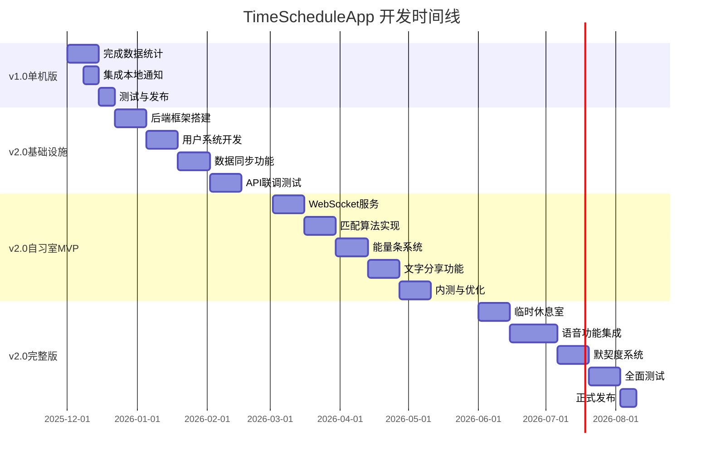

# TimeScheduleApp 产品路线图 v2.0
## 从单机应用到社交化自律空间

---

## 📌 版本规划概览

### FocusLife v1.0 (当前版本) - 单机版
**定位**: 个人时间与健康管理工具
**架构**: Flutter + Hive本地存储
**完成度**: 60% 核心功能已完成
**目标用户**: 有一定自律能力的个人用户

### TimeScheduleApp v2.0 (新产品方向) - 网络自习室版
**定位**: 社交化自律空间 - "从自律到他律"
**架构**: Flutter + 后端服务器 (Node.js/Go) + PostgreSQL/Redis/MongoDB
**完成度**: 0% (全新产品)
**目标用户**: 缺乏自律、需要外部监督的用户 (80%) + 自律用户 (20%)

---

## 🎯 产品战略决策点

### 方案A: 在现有基础上扩展 (推荐)
**优势**:
- 保留已完成的60%核心代码
- 可以快速上线v1.0单机版，验证基础功能
- 逐步添加社交功能，降低技术风险

**开发路径**:
```
FocusLife v1.0 (单机版)
    ↓ 2个月
添加后端服务器 + 基础API
    ↓ 1个月
添加简化版网络自习室
    ↓ 2个月
完整版TimeScheduleApp v2.0
```

**总耗时**: 约5个月

### 方案B: 推倒重建
**优势**:
- 从零开始,架构更统一
- 不受现有代码限制

**劣势**:
- 浪费已完成的8000+行代码
- 开发周期延长至少3个月
- 风险更高

**总耗时**: 约8个月

---

## 🔄 架构迁移方案 (推荐方案A)

### 第一阶段: 完成FocusLife v1.0 (4周)
**目标**: 上线可用的单机版本

**待完成功能**:
- [ ] 生成Hive Adapter代码
- [ ] 实现数据统计页面 (图表)
- [ ] 集成本地通知
- [ ] 全面测试并发布

**技术栈保持不变**:
- Flutter + Hive + Provider
- 纯本地存储,无需后端

### 第二阶段: 添加后端基础设施 (6-8周)
**目标**: 搭建服务器,实现用户系统和数据同步

**核心工作**:
1. **后端开发**
   - 选型: Node.js + Express (快速开发) 或 Go (高性能)
   - 数据库: PostgreSQL (用户/任务) + Redis (缓存)
   - 部署: Docker + 阿里云/AWS

2. **功能开发**
   - 用户注册/登录 (手机号/邮箱)
   - JWT token认证
   - 用户数据云同步 (可选功能)
   - RESTful API设计

3. **客户端改造**
   - 添加网络层 (Dio/http)
   - 实现在线/离线双模式
   - 数据同步逻辑
   - 保留Hive作为本地缓存

**数据库设计** (核心表):
```sql
-- 用户表
CREATE TABLE users (
  id VARCHAR(32) PRIMARY KEY,
  phone VARCHAR(20) UNIQUE,
  username VARCHAR(50),
  avatar_url VARCHAR(255),
  register_date TIMESTAMP,
  total_focus_time INT DEFAULT 0,
  points INT DEFAULT 0,
  study_room_unlocked BOOLEAN DEFAULT FALSE
);

-- 任务表 (与现有Task模型对应)
CREATE TABLE tasks (
  id VARCHAR(32) PRIMARY KEY,
  user_id VARCHAR(32),
  title VARCHAR(200),
  task_type VARCHAR(50),
  estimated_duration INT,
  due_date TIMESTAMP,
  priority VARCHAR(20),
  status VARCHAR(20),
  FOREIGN KEY (user_id) REFERENCES users(id)
);
```

### 第三阶段: 实现简化版网络自习室 (8-10周)
**目标**: MVP版自习室功能上线

**核心功能** (按PRD第3.2节):
1. **自习室准入机制**
   - 注册满3天 + 完成5次专注 OR 累计3小时
   - 解锁前可观摩优秀自习室

2. **自习室匹配**
   - 简化版算法: 仅按时间段和任务类型匹配
   - 展示3个推荐自习室
   - 可创建新自习室

3. **实时状态同步**
   - 技术: WebSocket (Socket.io)
   - 显示成员列表和能量条
   - 30秒心跳包更新

4. **能量条机制**
   - 客户端检测APP切换
   - 持续专注: +2%/5分钟
   - 检测到分心: -5%
   - 自习室总能量 = 平均值

5. **提前退出惩罚**
   - 剩余>50%: 扣100积分 + 24小时禁入
   - 剩余20-50%: 扣50积分 + 2小时禁入
   - 剩余<20%: 扣10积分

6. **文字分享**
   - 完成后30秒快速文字总结
   - 可选参与,不强制

**技术栈升级**:
```
客户端: Flutter + Provider + WebSocket
后端: Node.js + Socket.io + Redis (实时状态缓存)
数据库: PostgreSQL (自习室记录) + MongoDB (聊天记录)
```

**新增数据表**:
```sql
-- 自习室表
CREATE TABLE study_rooms (
  id VARCHAR(32) PRIMARY KEY,
  name VARCHAR(100),
  owner_id VARCHAR(32),
  max_members INT DEFAULT 6,
  start_time TIMESTAMP,
  end_time TIMESTAMP,
  task_types JSON,
  status VARCHAR(20),
  FOREIGN KEY (owner_id) REFERENCES users(id)
);

-- 自习室成员表
CREATE TABLE room_members (
  id VARCHAR(32) PRIMARY KEY,
  room_id VARCHAR(32),
  user_id VARCHAR(32),
  join_time TIMESTAMP,
  leave_time TIMESTAMP,
  current_energy INT DEFAULT 70,
  leave_reason VARCHAR(20),
  FOREIGN KEY (room_id) REFERENCES study_rooms(id),
  FOREIGN KEY (user_id) REFERENCES users(id)
);
```

### 第四阶段: 完整版社交功能 (8-10周)
**目标**: 完整实现PRD中的所有功能

**新增功能**:
1. **智能匹配算法** (PRD 3.2.2)
   - 时间重叠度 40%
   - 任务类型相似度 30%
   - 完成率接近 20%
   - 用户画像 10%

2. **临时休息室** (PRD 3.2.6)
   - 语音聊天功能 (WebRTC)
   - 5-10分钟倒计时
   - 自动返回专注状态

3. **房主转移机制** (PRD 3.2.5)
   - 房主退出 → 顺延给最早加入成员
   - 拒绝则继续顺延
   - 无人接受则进入"无房主模式"

4. **语音分享** (PRD 3.2.7)
   - 最长3分钟语音
   - Opus编码压缩
   - 存储到OSS
   - 7天后自动删除

5. **默契度系统** (PRD 3.3)
   - 共同完成任务 +5默契度
   - 等级: 陌生人 → 点头之交 → 学习伙伴 → 默契搭档 → 灵魂伴侣
   - 解锁私信、专属自习室等功能

6. **今日状态标记** (PRD 3.5)
   - 😊 状态很好 / 😐 一般般 / 😫 状态糟糕
   - 状态糟糕时降低惩罚力度
   - 不会被抽为"幸运分享者"

**技术栈完整版**:
```
前端: Flutter + Provider + WebSocket + WebRTC
后端: Node.js/Go + Socket.io + RabbitMQ (消息队列)
数据库:
  - PostgreSQL (用户/任务/自习室)
  - Redis (实时状态/匹配队列)
  - MongoDB (分享内容/聊天)
第三方服务:
  - 阿里云OSS (语音存储)
  - 腾讯云天御 (内容审核)
  - 极光推送 (通知)
```

**新增数据表**:
```sql
-- 默契度表
CREATE TABLE rapport_scores (
  id VARCHAR(32) PRIMARY KEY,
  user_a_id VARCHAR(32),
  user_b_id VARCHAR(32),
  score INT DEFAULT 0,
  last_updated TIMESTAMP,
  FOREIGN KEY (user_a_id) REFERENCES users(id),
  FOREIGN KEY (user_b_id) REFERENCES users(id)
);

-- 分享内容表
CREATE TABLE sharing_moments (
  id VARCHAR(32) PRIMARY KEY,
  room_id VARCHAR(32),
  user_id VARCHAR(32),
  content_type VARCHAR(20), -- voice/text
  content TEXT,
  duration INT,
  likes_count INT DEFAULT 0,
  created_at TIMESTAMP,
  FOREIGN KEY (room_id) REFERENCES study_rooms(id)
);
```

---

## 📊 功能对比表

| 功能模块 | FocusLife v1.0<br>(已完成60%) | TimeScheduleApp v2.0<br>(新需求) | 复用程度 |
|---------|-------------------------------|----------------------------------|---------|
| 用户系统 | ❌ 无(本地) | ✅ 注册/登录/JWT认证 | 0% - 需新建 |
| 任务管理 | ✅ 本地CRUD | ✅ 云端同步 + 本地缓存 | 70% - UI可复用 |
| 专注计时器 | ✅ 单机番茄钟 | ✅ 可选择独立/自习室模式 | 80% - 逻辑可复用 |
| 健康管理 | ✅ 睡眠/饮水/运动 | ⚠️ 保留但不作为核心 | 90% - 完全复用 |
| 数据统计 | ⏳ 未完成 | ✅ 个人+自习室数据 | 50% - 需扩展 |
| 网络自习室 | ❌ 无 | ✅ 核心功能 | 0% - 全新开发 |
| 实时通信 | ❌ 无 | ✅ WebSocket | 0% - 全新开发 |
| 能量条系统 | ❌ 无 | ✅ 实时可视化 | 0% - 全新开发 |
| 社交功能 | ❌ 无 | ✅ 默契度/私信 | 0% - 全新开发 |
| 语音功能 | ❌ 无 | ✅ 休息室/分享 | 0% - 全新开发 |

**总体复用率**: 约35-40%

---

## 💰 成本与资源评估

### 开发人力需求

**方案A (在现有基础上扩展)**:
```
第一阶段 (4周): 1前端 = 4人周
第二阶段 (8周): 1前端 + 1后端 = 16人周
第三阶段 (10周): 1前端 + 1后端 + 0.5测试 = 25人周
第四阶段 (10周): 1前端 + 1后端 + 0.5测试 = 25人周
--------------------------------------------
总计: 约70人周 (约17.5人月)
```

**方案B (推倒重建)**:
```
预估: 90-100人周 (约22-25人月)
```

### 服务器成本 (月度)

| 项目 | 配置 | 成本 (人民币) |
|------|------|--------------|
| 应用服务器 | 2核4G x2 | ¥200 |
| 数据库 | PostgreSQL 高可用 | ¥400 |
| Redis | 主从双节点 | ¥150 |
| MongoDB | 单节点 | ¥100 |
| OSS存储 | 100GB | ¥50 |
| CDN流量 | 100GB | ¥20 |
| 第三方服务 | 推送/审核 | ¥100 |
| **总计** | | **¥1020/月** |

**注**:
- 初期用户<1000人时,可降配至¥500/月
- 用户>10000人时,需扩容至¥3000-5000/月

---

## 🎯 里程碑时间表 (方案A)



**关键节点**:
- ✅ 2025-12-22: FocusLife v1.0 单机版发布
- 🎯 2026-02-28: 后端基础设施完成
- 🎯 2026-05-31: 自习室MVP上线内测
- 🎯 2026-08-10: TimeScheduleApp v2.0 完整版发布

---

## ⚠️ 风险预警

### 技术风险

| 风险 | 概率 | 影响 | 应对措施 |
|-----|------|------|---------|
| WebSocket高并发性能瓶颈 | 中 | 高 | 1. 提前进行压测<br>2. 准备Socket集群方案<br>3. Redis做消息队列 |
| 实时匹配算法效率低 | 高 | 中 | 1. 使用Redis Sorted Set预筛选<br>2. 缓存热门自习室<br>3. 异步计算得分 |
| 语音存储成本超预算 | 中 | 中 | 1. 限制语音时长(3分钟)<br>2. 7天自动删除<br>3. 使用Opus高压缩编码 |
| 内容审核漏检违规内容 | 低 | 高 | 1. 接入第三方审核API<br>2. 用户举报+人工复核<br>3. 首次分享需审核 |

### 产品风险

| 风险 | 概率 | 影响 | 应对措施 |
|-----|------|------|---------|
| 用户觉得"被监视"压力大 | 高 | 高 | 1. 强调"可选"属性<br>2. 独立模式永远可用<br>3. 提供隐身付费功能 |
| 自习室变成纯社交场所 | 中 | 中 | 1. 专注期间禁止聊天<br>2. 算法降低低完成率自习室权重 |
| 匹配不到合适自习室 | 高 | 中 | 1. 允许异步匹配<br>2. 提供AI自习室<br>3. 降低创建门槛 |
| 留存率低于预期 | 中 | 高 | 1. 密切监控DAU/MAU<br>2. A/B测试惩罚力度<br>3. 优化新手引导 |

### 运营风险

| 风险 | 概率 | 影响 | 应对措施 |
|-----|------|------|---------|
| 种子用户不够活跃 | 中 | 高 | 1. 内测邀请高质量用户<br>2. 前100名送会员<br>3. KOL推广 |
| 社区氛围变差 | 低 | 高 | 1. 严格社区规范<br>2. 快速封禁违规<br>3. 引导正向分享 |

---

## 📝 决策建议

### 给管理层的建议

**推荐方案: 方案A (分阶段扩展)**

**理由**:
1. **降低风险**: 先上线v1.0验证基础功能,再扩展社交
2. **节省成本**: 复用35-40%现有代码,节约约5人月
3. **快速试错**: v1.0上线后可收集真实用户反馈
4. **灵活调整**: 如果v1.0反响不佳,可及时调整v2.0方向

**关键决策点**:
- ✅ 立即启动: 完成v1.0剩余功能 (4周内发布)
- ⏸️ 暂缓评估: 观察v1.0的用户留存数据
- 🎯 2026-01启动: 如果v1.0数据健康,开始v2.0后端开发

**成功指标 (v1.0)**:
- 次日留存 ≥ 30%
- 7日留存 ≥ 15%
- 平均专注时长 ≥ 40分钟

**如果达标 → 继续v2.0开发**
**如果不达标 → 暂停,优化v1.0核心体验**

---

## 🔗 相关文档

- 📘 [FocusLife v1.0 开发报告](./PROJECT_FINAL_REPORT.md)
- 📙 [TimeScheduleApp v2.0 PRD](./PRODUCT_REQUIREMENTS_V2.md) *(本文档)*
- 📗 [技术架构设计](./TECH_ARCHITECTURE.md) *(待创建)*
- 📕 [数据库设计文档](./DATABASE_DESIGN.md) *(待创建)*

---

**文档版本**: v2.0
**创建日期**: 2025-11-23
**负责人**: 产品经理
**审核人**: 技术负责人
**状态**: 🟡 待决策

---

> **下一步行动**:
> 1. 管理层评审本路线图
> 2. 决策采用方案A或方案B
> 3. 完成FocusLife v1.0并发布
> 4. 根据v1.0数据决定是否启动v2.0
